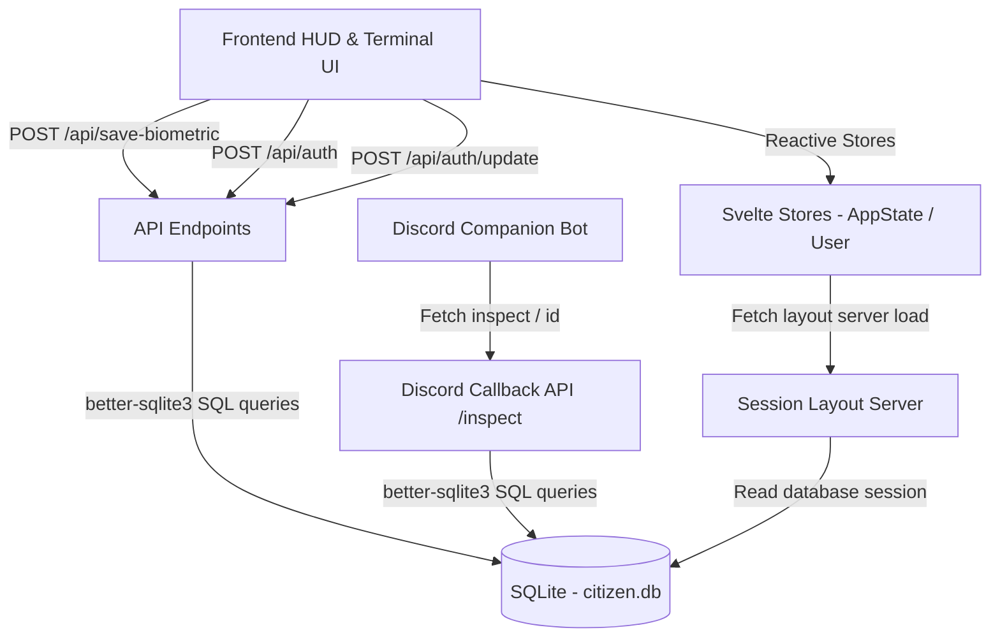

# SIBYL SYSTEM — Biometric Diagnostic Terminal

An interactive Cyberpunk-themed CLI dashboard and Biometric HUD simulation mirroring the **SIBYL System** from the *Psycho-Pass* universe. The application captures simulated camera bio-signals, evaluates Crime Coefficients (CC), analyzes emotional states via Empathy AI text diagnostics, logs longitudinal psychological health history, offers a therapeutic calming intervention protocol, and integrates a Discord bot companion to query and export security ID cards.

---

## Quick Start & Local Server Setup

### Prerequisites
* **Node.js**: Version 20.x or higher is recommended.
* **C++ Build Tools**: Required by `better-sqlite3` to compile native SQLite bindings on installation.

### Web Server Installation
1. Clone or download the repository to your local directory.
2. Install dependencies by running:
   ```bash
   npm install
   ```

### Running the Dev Server
Start the development server with hot-reloading:
```bash
npm run dev
```
The application will be accessible at: **`http://localhost:5173`**

### Building for Production
To generate a production-ready Node.js bundle:
1. Compile and build the project:
   ```bash
   npm run build
   ```
2. Preview the production build locally:
   ```bash
   npm run preview
   ```

---

## Friend & Community Systems

The SIBYL network enables citizens to establish compliance synchronization channels and explore the public database registry.

### 1. Compliance Sync Link (Friend Requests)
* **Status Levels**: Users can establish encrypted sync links. Statuses include `PENDING`, `ACCEPTED`, or `REJECTED`.
* **Privacy Controls**: When a citizen's profile privacy is set to `FRIENDS` (compliance synced), only profiles with an established/accepted sync link are authorized to view their longitudinal diagnostics and average Crime Coefficients.

### 2. Community Directory
* **Public Search**: A searchable global index of all registered citizens.
* **Registry Querying**: Citizens can query by Username or Citizen ID (`SIB-XXXXXXXX`). Search results respect user privacy levels (`PRIVATE` accounts will hide sensitive CC charts and scan histories from non-synced querying users).

---

## Discord Companion Bot Setup

The project includes a Discord bot companion located in the `sibyl-bot/` directory. It uses `@napi-rs/canvas` to render holographic ID cards dynamically.

### Setup Instructions
1. Navigate to the bot directory and install its dependencies:
   ```bash
   cd sibyl-bot
   npm install
   ```
2. Ensure you have populated `DISCORD_BOT_TOKEN` and `DISCORD_CLIENT_ID` in your root `.env` file.
3. Deploy the slash commands (`/inspect` and `/id`) to Discord:
   * **Global Deployment** (can take up to 1 hour to propagate):
     ```bash
     npm run deploy
     ```
   * **Instant Guild Deployment** (updates instantly on your testing server):
     ```bash
     node deploy-commands.js <YOUR_SERVER_ID>
     ```
4. Start the bot:
   ```bash
   npm start
   ```
   *(For production deployment, use `pm2 start sibyl-bot.js --name "sibyl-bot"`).*

### Bot Commands
* `/inspect <query>`: Query citizen profiles and check their psychological/diagnostic records. Only public profiles are inspectable unless the requesting Discord ID is linked to a SIBYL `ADMIN` profile.
* `/id <query>`: Generates and returns a beautiful, verified SIBYL citizen pass holographic ID card image matching the website design. The card dynamically renders the citizen's **average** Crime Coefficient & Hue, synced Discord profile name, and custom Base64 uploaded avatar.

---

## Technology Stack & Libraries

The system is built upon SvelteKit and integrates a high-performance native SQLite database:

| Dependency | Category | Purpose |
| :--- | :--- | :--- |
| **Svelte 5** | Core Framework | Powers the reactive state, component bindings, and visual transitions. |
| **SvelteKit 2** | Application Framework | Handles server-side rendering, routing, session layouts, and server endpoints. |
| **Vite 8** | Bundler & Dev Tooling | Serves as the high-speed dev server and compilation pipeline. |
| **better-sqlite3** | Database Driver | A high-performance, synchronous SQLite library for server-side persistence. |
| **bcryptjs** | Security | Hashes and verifies citizen credentials securely before session authorization. |
| **@napi-rs/canvas** | Graphics Rendering | Rust-compiled native canvas library used by the bot to draw PNG passes. |
| **discord.js** | Chat Integration | Connects the companion bot to Discord's gateway APIs. |

---

## System Architecture & Data Flow

The application is structured into clearly separated presentation, state-management, and data persistence layers:



### 1. Database Layer (`src/lib/server/db.ts`)
Creates and initializes `citizen.db` automatically in the workspace root. It manages:
* **`users`**: Stores credentials (`id`, `username` (1-15 chars), `password` hashed, `avatar` profile image data, `citizen_id` unique pass reference, `privacy` settings, `discord_username`, `discord_id`, and SIBYL account `role`).
* **`userStats`**: Tracks psychological history entries. Each record maps a citizen (`userId`) to a specific `cc` score, logged with a `created_at` timestamp. This enables storing multiple daily values to generate historical trends and calculate **average Crime Coefficient** metrics.
* **`friend_requests`**: Stores compliance synchronization link requests between citizens (`senderId`, `receiverId`, `status` (`PENDING`/`ACCEPTED`/`REJECTED`), and timestamp).

### 2. Backend API Endpoints (`src/routes/api/`)
* **`/api/auth`**: Signs users in/out and handles registration constraints (verifying username length between 1 and 15 characters, and password strength).
* **`/api/auth/update`**: Updates user identifiers, privacy level, and password credentials.
* **`/api/discord/inspect`**: Serves queries from the Discord bot, returning authorized telemetry details.
* **`/api/stats`**: Queries statistical history records to supply chart components.
* **`/api/save-avatar`**: Manages Base64 profile avatar conversions.
* **`/api/friends`**: Manages querying, establishing, accepting, and deleting sync links between citizens.

### 3. Frontend Layouts & Component Tree (`src/lib/components/`)
* **`ScannerHUD.svelte`**: Displays a mock scanner interface. While active, it scrambles numbers and reads telemetry. Once locked, it calculates a CC up to **500** and renders dynamic biometric breakdown parameters:
  * **Optimal (CC <= 100)**: Normal heart rate, constricted pupils, deep breathing, alpha wave dominance.
  - **Warning (100 < CC <= 300)**: Sympathetic arousal, mydriasis, rapid breathing, high anxiety, beta waves.
  - **Critical (CC > 300)**: Acute tachycardia, severe dilation, hyperventilation, aggression spikes, chaotic high-beta waves.
* **`Terminal.svelte`**: A text CLI node supporting command inputs (`REGISTER`, `LOGIN`, `EVALUATE`, `TREND`, `LANG [EN/FR]`, `CLEAR`, `EXIT`).
* **`BreathingVisualizer.svelte`**: A calming breathing assistant that initiates if the subject's CC > 100, smoothly reducing their Crime Coefficient down to a stable baseline (~75) in real-time.
* **`/invite` Page**: Enables citizens to integrate the bot into their servers or user channels.
* **`/friends` Page**: Manages active compliance sync links and allows sending new invites.
* **`/community` Page**: Displays the global search registry directory.

---

## Session Security & Privacy Settings
* **Biometric Privacy**: The camera feed is visually masked via CSS (`width: 1px`, `height: 1px`, `opacity: 0`) to respect user privacy.
* **HTTP Session Lifetimes**: User cookies utilize standard session headers containing no expiration attributes, meaning authentication variables are immediately cleared from browser RAM once the tab or browser session terminates.
* **Discord Sync Constraints**: A Discord account can only be linked to 1 citizen profile at a time.
