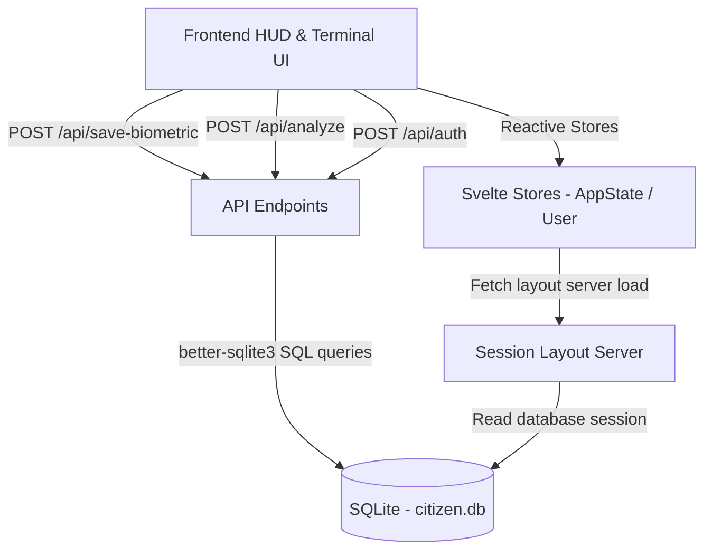

# SIBYL SYSTEM — Biometric Diagnostic Terminal

An interactive Cyberpunk-themed CLI dashboard and Biometric HUD simulation mirroring the **SIBYL System** from the *Psycho-Pass* universe. The application captures simulated camera bio-signals, evaluates Crime Coefficients (CC), analyzes emotional states via Empathy AI text diagnostics, logs longitudinal psychological health history, and offers a therapeutic calming intervention protocol.

---

## Quick Start & Local Server Setup

### Prerequisites
* **Node.js**: Version 20.x or higher is recommended.
* **C++ Build Tools**: Required by `better-sqlite3` to compile native SQLite bindings on installation.

### Installation
1. Clone or download the repository to your local directory.
2. Install dependencies by running:
   ```bash
   npm install
   ```

### Running the Dev Server
Start the development server with hot-reloading:
```bash
npm run dev
```
The application will be accessible at: **`http://localhost:5173`**

### Building for Production
To generate a production-ready Node.js bundle:
1. Compile and build the project:
   ```bash
   npm run build
   ```
2. Preview the production build locally:
   ```bash
   npm run preview
   ```

### Code Verification
Run TypeScript type-checking and Svelte diagnostics:
```bash
npm run check
```

---

## Technology Stack & Libraries

The system is built upon SvelteKit and integrates a high-performance native SQLite database:

| Dependency | Category | Purpose |
| :--- | :--- | :--- |
| **Svelte 5** | Core Framework | Powers the reactive state, component bindings, and visual transitions. |
| **SvelteKit 2** | Application Framework | Handles server-side rendering, routing, session layouts, and server endpoints. |
| **Vite 8** | Bundler & Dev Tooling | Serves as the high-speed dev server and compilation pipeline. |
| **better-sqlite3** | Database Driver | A high-performance, synchronous SQLite library for server-side persistence. |
| **bcryptjs** | Security | Hashes and verifies citizen credentials securely before session authorization. |
| **dotenv** | Environment Configuration | Manages backend environment variables (e.g., pathing for the SQLite file). |

---

## System Architecture & Data Flow

The application is structured into clearly separated presentation, state-management, and data persistence layers:



### 1. Database Layer (`src/lib/server/db.ts`)
Creates and initializes `citizen.db` automatically in the workspace root. It manages two main tables:
* **`users`**: Stores unique login credentials (`id`, `username`, `password` hashed, and optional Base64 `avatar` profile image data).
* **`userStats`**: Tracks psychological history entries. Each record maps a citizen (`userId`) to a specific `cc` score, logged with a `created_at` timestamp. This enables storing multiple daily values to generate historical trends.

### 2. Backend API Endpoints (`src/routes/api/`)
* **`/api/auth`**: Signs users in/out. Employs security practices by setting an HTTP-Only **Session Cookie** that remains active until the browser is closed or the user signs out.
* **`/api/save-biometric`**: Logs biometric scan results to the user history.
* **`/api/analyze`**: Logs manual Empathy AI text diagnostics.
* **`/api/stats`**: Queries statistical history records to supply chart components.
* **`/api/save-avatar`**: Manages Base64 profile avatar conversions.

### 3. Frontend Layouts & Component Tree (`src/lib/components/`)
* **`ScannerHUD.svelte`**: Displays a mock scanner interface. While active, it scrambles numbers and reads telemetry. Once locked, it calculates a CC up to **500** and renders dynamic biometric breakdown parameters:
  * **Optimal (CC <= 100)**: Normal heart rate, constricted pupils, deep breathing, alpha wave dominance.
  - **Warning (100 < CC <= 300)**: Sympathetic arousal, mydriasis, rapid breathing, high anxiety, beta waves.
  - **Critical (CC > 300)**: Acute tachycardia, severe dilation, hyperventilation, aggression spikes, chaotic high-beta waves.
* **`Terminal.svelte`**: A text CLI node supporting command inputs (`REGISTER`, `LOGIN`, `EVALUATE`, `TREND`, `LANG [EN/FR]`, `CLEAR`, `EXIT`).
* **`BreathingVisualizer.svelte`**: A calming breathing assistant that initiates if the subject's CC > 100, smoothly reducing their Crime Coefficient down to a stable baseline (~75) in real-time.

### 4. Localization & State Management (`src/lib/i18n.ts`)
* Implements a dynamic translation system splitting vocabulary lists into separate localized JSON structures ([en.json](src/lib/locales/en.json) and [fr.json](src/lib/locales/fr.json)).
* Switchable dynamically during live execution using either the global navigation toggle button or the terminal `LANG` command.

---

## Session Security & Privacy Settings
* **Biometric Privacy**: The camera feed is visually masked via CSS (`width: 1px`, `height: 1px`, `opacity: 0`) to respect user privacy. The application keeps the media stream active solely to feed simulated telemetry scanners without recording or transmitting actual video data.
* **HTTP Session Lifetimes**: User cookies utilize standard session headers containing no expiration attributes, meaning authentication variables are immediately cleared from browser RAM once the tab or browser session terminates.
